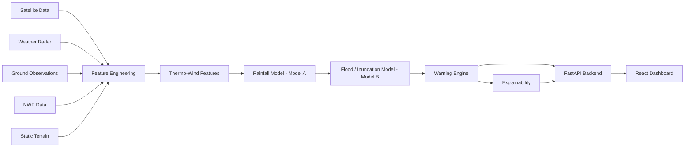

# VarshaNetra

**AI/ML-based early-warning and inundation prediction system** integrating
satellite imagery, weather radar, ground observations, and numerical
weather prediction (NWP) data to predict heavy rainfall and its potential
flood impact — built for **Smart India Hackathon 2026**.

> Developed as a prototype AI/ML solution for heavy rainfall early warning
> and inundation prediction. This is a hackathon/research-stage project —
> it is **not** a government-deployed or operationally-certified system.
> See [Current Prototype Limitations](#current-prototype-limitations) below.

---

## Problem

Heavy rainfall events in India — especially in hill and North-East states —
can escalate into flash floods and urban inundation with very little
warning. Existing forecasts are often coarse-grained (district/state level)
and don't fuse the full range of available signals (satellite cloud
evolution, radar, ground sensors, NWP) into a single, spatially fine-grained,
short-lead-time early warning. Communities and disaster-management teams
need **hours**, not days, of actionable lead time — and need to know not
just *that* a warning fired, but *why*.

## Solution

VarshaNetra fuses five data modalities into a single machine-learning
pipeline:

- **Satellite** (INSAT-class IR brightness temperature, cloud-top
  height/temperature, OLR, cloud motion vectors, QPE)
- **Weather radar** (reflectivity, radial velocity, VIL, echo-top height)
- **Ground observations** (rainfall gauges, wind, humidity, pressure, soil
  moisture, river stage)
- **NWP forecasts** (precipitation, CAPE/CIN, wind, geopotential height)
- **Static terrain** (elevation, slope, land use, drainage density,
  distance-to-river)

...and engineers a dedicated **Thermo-Wind feature set** (below) from the
thermal and wind signals specifically, on top of the raw inputs. Two
coupled model families are trained: **Model A** (rainfall amount,
category, and heavy-rain probability, for 1h–72h lead times) and **Model
B** (flood probability and inundation depth, for 1h–48h lead times),
feeding a calibrated **GREEN/YELLOW/ORANGE/RED warning engine** and an
explainability layer that answers *"why did this warning fire?"*

## Key Innovation — the Thermo-Wind Module

The core innovation is combining **thermodynamic/cloud-top information**
with **wind-field behavior** as an explicit, dedicated feature set — the
premise being that cloud-top cooling *combined with* moisture-convergent
wind patterns carries predictive signal about rainfall
development/intensification beyond what either signal carries alone.

Representative engineered features (full list in
[`docs/model.md`](docs/model.md)):

```text
u_wind, v_wind              — wind vector components
wind_convergence             — local wind-field convergence (moisture inflow proxy)
thermal_gradient              — brightness-temperature rate of change
cloud_top_cooling_rate         — the negative part of thermal_gradient
cold_cloud_fraction             — fraction of a cell's neighborhood below a cold-cloud threshold
```

...plus explicit interaction terms (e.g. `cooling_rate_x_wind_speed`,
`cold_cloud_fraction_x_convergence`) — computed, not causally asserted; see
[`docs/model.md`](docs/model.md) for the full feature list and an honest
account of which variables are measured directly vs. engineered.

## System Architecture



Full detail, including the multi-branch deep-learning architecture that
sits behind the currently-served baseline models, is in
[`docs/architecture.md`](docs/architecture.md).

## Features

- Multi-horizon rainfall forecasting (1h, 3h, 6h, 12h, 24h, 48h, 72h)
- Flood probability + inundation depth forecasting (1h–48h)
- Thermo-Wind feature engineering module (satellite + wind fusion)
- Leakage-safe chronological train/val/test splitting with a named
  extreme-event holdout
- Baseline-vs-proposed ablation study quantifying the Thermo-Wind module's
  actual measured effect (see `backend/outputs/`)
- Calibrated GREEN/YELLOW/ORANGE/RED warning engine (thresholds fit from
  validation-set precision/recall, not hardcoded)
- Explainability: per-prediction top contributing features
- FastAPI inference service with a demo endpoint for UIs without live
  sensor ingestion yet
- React dashboard with live/offline states, region selection, and a
  "why this warning?" panel
- A written (not yet trained — see limitations) full multimodal deep
  architecture: ConvLSTM/Transformer encoders, cross-attention + gating
  fusion, multi-task heads, MC-dropout uncertainty, and an optional
  river/drainage GNN branch

## Technology Stack

```text
Frontend:
  React, Vite, TypeScript, Tailwind CSS, React Router

Backend:
  Python, FastAPI, Pydantic, Uvicorn

Machine Learning:
  scikit-learn (currently-served baseline models: HistGradientBoosting)
  PyTorch (full deep architecture — implemented, not yet trained; see
  Current Prototype Limitations)

Data / Feature Engineering:
  NumPy, pandas, SciPy

Documented but not yet exercised in this environment (no internet/GPU
during development — see docs/setup.md):
  xarray, rasterio, wradlib, GeoPandas, Zarr/NetCDF, SHAP, Grad-CAM
```

## Project Structure

```text
VarshaNetra/
├── README.md                  you are here
├── LICENSE
├── .gitignore
├── .env.example
├── render.yaml                 optional one-click deploy (Render)
├── docker-compose.yml           optional local multi-service run
│
├── frontend/                    React + Vite + TypeScript dashboard
│   ├── src/
│   │   ├── pages/                (Dashboard is the wired-up page; others are placeholders)
│   │   ├── services/varshanetraApi.ts   typed API client
│   │   └── components/
│   ├── .env.example
│   └── INTEGRATION.md            exactly what's real vs. simulated in the UI
│
├── backend/                     Python ML system
│   ├── src/varshanetra/
│   │   ├── data/                 schema, synthetic data generator, chronological split
│   │   ├── features/thermo_wind.py   the core innovation module
│   │   ├── models/                encoders, fusion, losses, full deep model, GNN branch
│   │   ├── training/               baselines, ablation study, deep-model training loop
│   │   ├── evaluation/             metrics
│   │   ├── warning/                 GREEN/YELLOW/ORANGE/RED calibration
│   │   ├── explainability/          SHAP / Grad-CAM / gate-weight attribution
│   │   └── inference/                pipeline, FastAPI app, demo-mode endpoint
│   ├── tests/                    smoke tests (see docs/setup.md to run them)
│   ├── config/config.yaml         single source of truth for grid/lead-times/weights
│   ├── checkpoints/                trained baseline models (committed — see .gitignore)
│   ├── outputs/                    real ablation-study results from an actual run
│   ├── run_mvp.py                 end-to-end progressive-build script
│   └── README.md                  full backend technical documentation
│
├── docs/
│   ├── architecture.md
│   ├── model.md
│   ├── api.md
│   └── setup.md
│
└── screenshots/
```

## Installation

### Prerequisites
- Python 3.10+
- Node.js 18+ and npm
- Git

### Windows

```powershell
git clone https://github.com/<your-username>/VarshaNetra.git
cd VarshaNetra

# Backend
cd backend
python -m venv .venv
.venv\Scripts\activate
pip install -r requirements.txt
cd ..

# Frontend
cd frontend
copy .env.example .env.local
npm install
cd ..
```

### Linux / macOS

```bash
git clone https://github.com/<your-username>/VarshaNetra.git
cd VarshaNetra

# Backend
cd backend
python3 -m venv .venv
source .venv/bin/activate
pip install -r requirements.txt
cd ..

# Frontend
cd frontend
cp .env.example .env.local
npm install
cd ..
```

Full step-by-step (including troubleshooting) is in
[`docs/setup.md`](docs/setup.md).

## Running the Backend

```bash
cd backend
# with the virtualenv from Installation still active:
PYTHONPATH=src uvicorn varshanetra.inference.api:app --reload --port 8000
```
Check it's up: `curl http://localhost:8000/health`

To see the full progressive-build pipeline (data generation → Thermo-Wind
features → ablation study → training → inference) run instead:
```bash
python3 run_mvp.py
```

## Running the Frontend

```bash
cd frontend
npm run dev
```
Open the printed local URL and go to `/dashboard`. A green "Live Model"
badge means it's talking to the backend; a red "Backend offline" banner
means the backend isn't running or `.env.local`'s `VITE_API_BASE_URL`
doesn't match — see [`frontend/INTEGRATION.md`](frontend/INTEGRATION.md).

Production build: `npm run build` (output in `frontend/dist/`).

## Running via Docker (alternative)

```bash
docker compose up --build
```
Backend on `http://localhost:8000`, frontend on `http://localhost:5173`.

**Honesty note:** `docker-compose.yml` and both `Dockerfile`s were written
carefully but **not build-tested** in the environment they were authored in
(no Docker daemon available there). Test `docker compose up --build`
yourself before relying on it for a demo — the most likely failure point is
GDAL/system deps for the geospatial packages in `backend/requirements.txt`,
not the application code itself (which was actually run and verified — see
`docs/setup.md`).

## API

Full request/response documentation, including examples, is in
[`docs/api.md`](docs/api.md). Actual implemented endpoints:

| Method | Path | Purpose |
|---|---|---|
| GET | `/health` | Model-loading status |
| POST | `/predict/full` | Full Section-16-schema prediction from real sensor records |
| POST | `/predict/rainfall` | Rainfall-only subset of `/predict/full` |
| POST | `/predict/flood` | Flood-only subset of `/predict/full` |
| GET | `/demo/regions` | Named regions the demo endpoint supports |
| POST | `/demo/predict` | Single-location prediction using **simulated** current conditions |
| GET | `/config/thresholds` | Current warning-level thresholds |
| POST | `/config/calibrate` | Recalibrate thresholds from labeled validation data |

## Model

The rainfall and flood models are gradient-boosted (HistGradientBoosting)
baselines trained on a physically-consistent **synthetic** dataset (real
INSAT/IMD/NCMRWF access requires institutional registration this project
doesn't have — see `backend/README.md` §2). A full PyTorch multimodal deep
architecture is implemented for when real data and GPU access are
available. Full explanation of inputs, features, training, and evaluation:
[`docs/model.md`](docs/model.md).

## Current Prototype Limitations

Stated plainly, not glossed over:

- **No real satellite/radar/NWP/gauge data has been used anywhere in this
  project.** All training and demo predictions use a physically-consistent
  synthetic dataset (see `backend/src/varshanetra/data/synthetic_data.py`).
- **The dashboard's "current conditions" (rainfall so far, wind, soil
  moisture) shown for a selected region are simulated**, not from a live
  feed — every prediction response says so explicitly (`demo_mode`,
  `data_source_notice`), and the UI surfaces that banner rather than hiding
  it.
- **The full deep multimodal architecture has never actually been
  trained** — it was written and verified for correct tensor shapes /
  syntax, but the environment it was built in had no GPU/PyTorch/internet
  access to run an actual training loop. The models currently served are
  the simpler gradient-boosted baselines.
- **Geographic coverage is limited** to whatever region a deployment
  configures (`config/config.yaml` → `grid.region_bbox`); this repo's demo
  endpoint is pre-configured for four North-East India states as an
  example, not a claim of national coverage.
- **No production real-time data pipeline exists.** `run_mvp.py` and the
  `/demo/predict` endpoint both use synthetic data generation, not a live
  ingestion service.
- Model accuracy figures in `backend/outputs/` are measured on the
  synthetic dataset described above — they demonstrate that the
  measurement pipeline (the ablation study, the metrics) works correctly,
  not real-world skill.

## Future Scope

- Live INSAT-3D/3DR satellite integration (via MOSDAC)
- IMD Doppler Weather Radar integration
- Automated NCMRWF NWP ingestion
- Real-time data pipeline replacing the synthetic demo generator
- Higher-resolution (sub-1km) inundation mapping
- District/city-level operational deployment
- Full deep-model training on real data with GPU access
- Expanded uncertainty estimation (MC-dropout / deep ensembles, already
  implemented in code, pending real training data)
- River/drainage-network GNN branch using real hydrological topology
  (currently a k-nearest-neighbor proxy graph — see `docs/model.md`)

## SIH 2026

This project is developed as an AI/ML-based solution for heavy rainfall
early warning and inundation prediction, submitted for Smart India
Hackathon 2026 evaluation. It represents a working prototype and
architecture, not a deployed or government-endorsed operational system.

## License

MIT — see [`LICENSE`](LICENSE).
