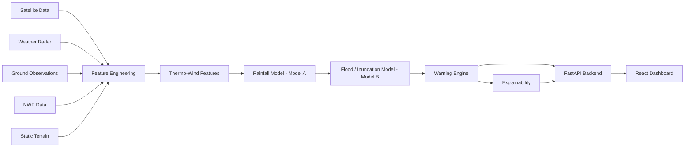

# Architecture

## Overview



## Two layers: what's served today vs. what's implemented for later

| Layer | Status | Code |
|---|---|---|
| **Baseline models** (HistGradientBoosting regressors/classifiers, one per lead time, per task) | **Trained and currently served** — checkpoints in `backend/checkpoints/` | `backend/src/varshanetra/training/baseline.py` |
| **Full multimodal deep architecture** (5 branches, cross-attention fusion, multi-task heads, MC-dropout uncertainty, optional GNN branch) | **Implemented, tensor-shape-verified, never actually trained** (no GPU/PyTorch/internet in the development environment) | `backend/src/varshanetra/models/` |

The API and dashboard don't know or care which layer is answering a given
request — `InferencePipeline.predict()` returns the same schema either way
(see `docs/api.md`), so swapping the deep model in once it's trained is a
one-line change in `backend/src/varshanetra/inference/pipeline.py`, not a
frontend or API contract change.

## Backend request flow

```text
Client request (React dashboard or any HTTP client)
      │
      ▼
FastAPI (inference/api.py)
      │
      ▼
InferencePipeline.predict() (inference/pipeline.py)
      │
      ├─► QualityControl.apply()        — range-check + causal gap-fill
      ├─► build_thermo_wind_features()  — the core innovation module
      ├─► <lead-time>-specific model.predict()
      └─► WarningEngine.classify_warning()
      │
      ▼
Section-16-schema JSON response
      │
      ▼
React dashboard (services/varshanetraApi.ts → pages/Dashboard.tsx)
```

## Demo-mode data flow (`/demo/predict`)

Since no real sensor/satellite ingestion is connected yet, `/demo/predict`
generates a short, physically-consistent synthetic "current conditions"
window for a named region (`inference/demo.py`), then runs it through the
**same real pipeline** above. Every response is tagged `demo_mode: true` /
`data_source: "synthetic"` so this is never silently presented as live data.

```text
Region name (e.g. "assam")
      │
      ▼
NER_REGIONS lookup → (lat, lon)
      │
      ▼
generate_synthetic_dataset(center=(lat, lon))   — same generator used for training
      │
      ▼
InferencePipeline.predict()   — the real model, same as /predict/full
      │
      ▼
+ demo_mode / data_source_notice / current_conditions snapshot
```

## Data modalities and where each is used

| Modality | Source (production) | Source (this repo, today) | Used by |
|---|---|---|---|
| Satellite | INSAT-3D/3DR (via MOSDAC) | Synthetic generator | Thermo-Wind features, rainfall model |
| Radar | IMD Doppler Weather Radar | Synthetic generator | Rainfall model |
| Ground observations | IMD/CWC gauge network | Synthetic generator | Both models, Thermo-Wind wind features |
| NWP | NCMRWF forecasts | Synthetic generator | Both models |
| Static terrain | DEM/LULC/soil datasets | Synthetic generator (fixed per grid cell) | Flood model |

## Frontend architecture

```text
App.tsx (React Router)
  └── AppLayout (Sidebar, TopBar)
        └── Dashboard.tsx  ◄── the only page currently wired to real data
              ├── services/varshanetraApi.ts  → POST /demo/predict
              └── services/mockData.ts         → offline fallback only
```

Other routed pages (`/forecast`, `/alerts`, `/map`, `/reports`,
`/field-officer`, `/settings`, `/about`, `/contact`) are placeholder UI, not
yet wired to the backend — see `frontend/INTEGRATION.md` for the concrete
next steps to wire each one up (most, e.g. `/alerts`, need no new backend
work — they can reuse `/demo/predict` across all regions).

## Deployment topology (optional)

```text
                 ┌─────────────────────┐
  Browser  ────► │  Frontend (static)   │
                 │  Vercel/Render/Pages  │
                 └──────────┬───────────┘
                             │ HTTPS (CORS)
                             ▼
                 ┌─────────────────────┐
                 │  Backend (FastAPI)    │
                 │  Render/Railway/Fly    │
                 └──────────┬───────────┘
                             │ loads at startup
                             ▼
                 ┌─────────────────────┐
                 │  checkpoints/*.pkl     │
                 │  (committed to repo)   │
                 └─────────────────────┘
```
See `render.yaml` at the repo root for a working (though not yet
live-deployed from this environment) Render Blueprint implementing this.
